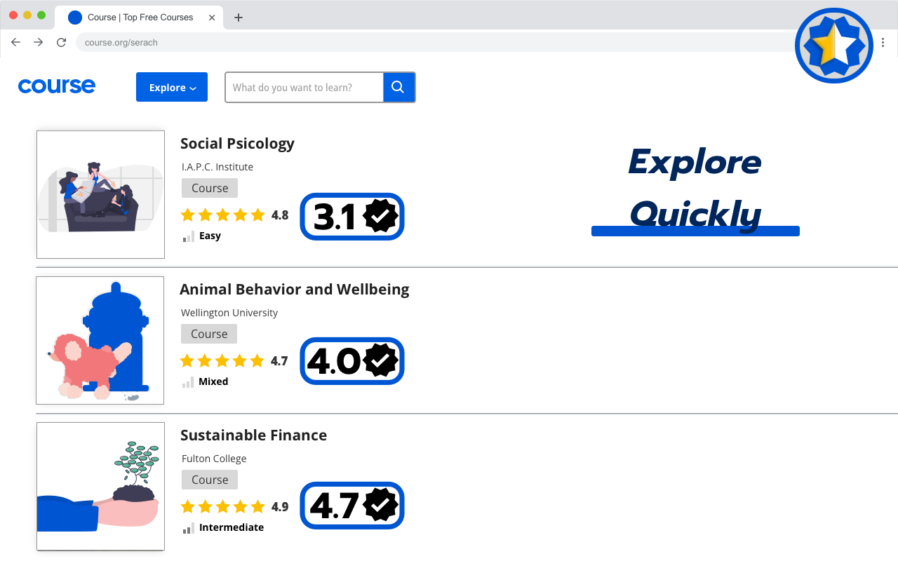

Stellaid is a no nonsense Chrome extension that uses the reviews of other students to give a more accurate rating to the course, to save you time and money.

If you have been browsing Coursera maybe you have thought `WOW! All courses have between 4.5 and 4.9 stars`, and they really do, but not all courses are that great, that's where Stellaid comes in, with a single click you will know if the course is worth your time and effort, just check the new rating in parentheses with the  to the right of the Coursera original score.

You can use it anywhere where you see ⭐ star ratings ⭐ in Coursera,

## Build locally

1. Checkout the copied repository to your local machine eg. with `git clone https://github.com/my-username/my-awesome-extension/`
1. run `npm install` to install all required dependencies
1. run `npm run build`

The build step will create the `distribution` folder, this folder will contain the generated extension.

## Run the extension

Using [web-ext](https://extensionworkshop.com/documentation/develop/getting-started-with-web-ext/) is recommened for automatic reloading and running in a dedicated browser instance. Alternatively you can load the extension manually (see below).

1. run `npm run watch` to watch for file changes and build continuously
1. run `npm install --global web-ext` (only only for the first time)
1. in another terminal, run `web-ext run` for Firefox or `web-ext run -t chromium`
1. Check that the extension is loaded by opening the extension options ([in Firefox](media/extension_options_firefox.png) or [in Chrome](media/extension_options_chrome.png)).

### Manually

You can also [load the extension manually in Chrome](https://www.smashingmagazine.com/2017/04/browser-extension-edge-chrome-firefox-opera-brave-vivaldi/#google-chrome-opera-vivaldi) or [Firefox](https://www.smashingmagazine.com/2017/04/browser-extension-edge-chrome-firefox-opera-brave-vivaldi/#mozilla-firefox).

## Acknowledgments

[Fregante's Browser Extension Template](https://github.com/fregante/browser-extension-template)

